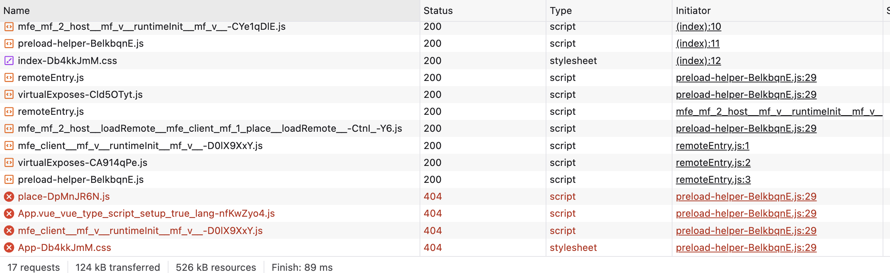

There is a bug where, for production builds (not `vite dev`) the host will preload assets from its own domain. You can reproduce this by running `./reproduction.sh`:

```sh
chmod +x reproduction.sh
./reproduction.sh
```

Visiting the remote, `http://localhost:4000`, is fine. It loads a remote module exposed from the host, `http://localhost:3000`, which logs a greeting (see the console).

Visitng the host, `http://localhost:3000`, however, shows the issue. The `preload-helper` tries to load the remote asset, such as `place.js`, from `http://localhost:3000/assets/place-DpMnJR6N.js` - it should be from `http://localhost:4000/assets/place-DpMnJR6N.js`. 



The problem is more clear when you look at the `preload` code:

```js
const scriptRel = 'modulepreload';
const assetsURL = function(dep) { return "/" + dep };
```

All assets are preloaded from `/`. 


